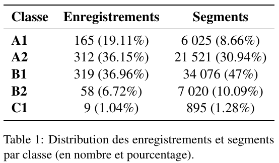

# Repository Overview: Multiclass Language Level Classification

This repository is dedicated to a multiclass classification task aimed at determining the language proficiency level of speakers from audio recordings. Specifically, it involves the classification of French audio recordings based on the language proficiency of native French speakers.

## Project Description

The classification project uses 863 French audio files sourced from the Audio Lingua platform by the Académie de Versailles, which allows educational and pedagogical use of its content. These recordings are typically used as teaching aids in foreign language classrooms and include various languages, with this project focusing on French.

**The comprehensive details of the project's methodology, data handling, and objectives are documented in a paper located in the root directory of this repository.**

## Data Presentation

### Source:
The audio files were collected from [Audio Lingua](https://audio-lingua.ac-versailles.fr/), where they are made freely available for educational use.

### Contents:
The repository includes:
- Metadata for each recording such as the speaker's name, age, and region of origin
- Notebooks containing all of the required steps for scrapping, data processing, training and evaluation.

## Retrieving Data

Data acquisition was performed using the Selenium Library due to the dynamic nature of the website and the complex interactions required to access specific information. Details of the scraping process are available in the `scraping` notebook, which can be adapted to other languages available on the website if necessary.

A few numbers regarding the data:

## Data Processing

The raw audio data underwent several processing steps:
1. **Segmentation**: Audio files were segmented into shorter clips for more effective training.
2. **Hanning Window Application**: To reduce spectral leakage.
3. **Noise Addition**: White noise was added to mitigate recording method biases.
4. **MEL Spectrogram Conversion**: For use in Convolutional Neural Networks (CNNs).
5. **Transcription and Alignment**: Audio was transcribed using Whisper, and transcripts were aligned with audio using WebMaus.

These processes are detailed in the `processing` notebook. Due to file size constraints, resulting files are not stored in this repository.

## Training and Evaluation

All training and evaluation procedures are documented in the `neural_networks` notebook and contain:

- Descriptions of neural network architectures used.
- Data balancing techniques and steps to generate word embeddings.

